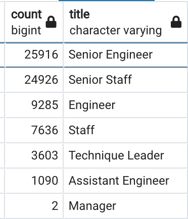
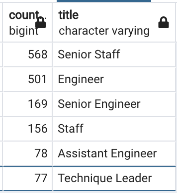

# Pewlett Hackard Analysis
## Overview of the analysis
The purpose of this analysis was to prepare Bobby’s manager for the silver tsunami as many current employees at reach retirement age at Pewlett Hackard. To help with this analysis the number of retiring employees per title were determined as well as employees who were eligible to participate in a mentorship program were identified. 

## Results 
Through the analysis, queries and tables were created from the provided data from the company. 
The four tables (saved as CSV files) that were created are as follows:
-	Retirement Titles – includes all employees at retirement age.
-	Unique Titles –similar table to retirement titles but only unique titles were kept from the retirement titles table as employees were promoted during their employment with the company. 
-	Retiring titles –table that lists the titles and the respective number of employees of retiring age who currently have that title. 
-	Mentorship Eligibility - table that holds the employees who are eligible to participate in a mentorship program.

From these tables, four major points were discovered:
1. Many employees are at retirement age and have been with the company for time during which they were promoted. This was seen from the retirement titles and unique titles tables. A number of employees have had more than one titles during their duration at the company.
2. Many retirement age employees are at a senior level, senior engineer and senior staff. The retiring titles table shows that around 50,000 employees are either senior engineers or senior staff. 
 

4. Retirement age employees are available for mentorship of younger employees. The mentorship eligibility table shows that there are retirement age employees are available for mentorship. An additional query and table would be needed to determine if there are enough mentors, (this is discussed below in the summary section).
5. Variety of employees can mentor. The mentorship eligibility table also shows that there are a variety of retirement age employees that can mentor, in terms of titles. This shows that the unique knowledge of certain titles will not disappear with the employees who are retiring.  

## Summary
In short, there will be a significant number of employees retiring from Pewlett Hackard in the coming years. In total, 72,458 roles will need to be filled as the "silver tsunami" begins to make an impact. A query was run on the unique titles table to determine this:

SELECT COUNT(ut.title)

FROM unique_titles AS ut; 

The company will need to make sure no institutional knowledge is lost as these employees retire. There are enough qualified, retirement-ready employees in the departments to mentor the next generation of employees. A query was run which created the following data output showing the number of mentors by title. The output shows that there are mentors for each title, except the manager title, as there are only 2 employees with the manager title retiring it is acceptable.   
The mentorship program will be invaluable for Pewlett Hackard and should be implemented as soon as possible.
